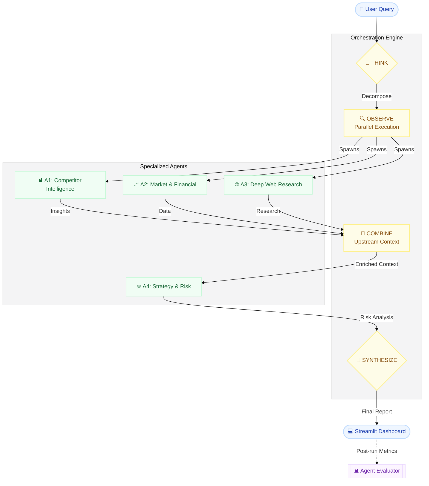

# Orcheonix

[](https://www.python.org/downloads/)
[](https://opensource.org/licenses/MIT)
[](https://streamlit.io/)
[](https://openai.com/)
[](https://github.com/MohamadQutainy/Orcheonix/actions/workflows/tests.yml)

**Multi-agent business intelligence platform powered by the OpenAI API.**

Orcheonix accepts a single strategic query and produces an executive-ready intelligence report covering competitors, market and financial signals, deep web research, strategy, risk, compliance, and implementation planning. A ReAct orchestrator coordinates four specialized agents, runs upstream work in parallel, synthesizes a unified report, and scores every agent output with deterministic metrics.

Default model: `gpt-5.4-nano` (configurable via `MODEL_NAME`).
## Demo
<video src="https://github.com/user-attachments/assets/5d87851e-255a-4d82-acb3-d65bf7c3cf4f" width="100%" controls></video>

## ✨ Key Features

- **🤖 Multi-Agent Architecture** - Four specialized agents (Competitor, Finance, Research, Strategy) working in concert
- **⚡ Parallel Execution** - Upstream agents run concurrently for maximum efficiency
- **🎯 ReAct Orchestration** - Plan, execute, observe, and synthesize in a structured pipeline
- **🔗 Real Tool Integrations** - Serper, Firecrawl, DuckDuckGo, YFinance, Agno, and OpenAI Agents SDK
- **📊 Deterministic Evaluation** - Confidence, relevance, completeness, and hallucination risk scoring without extra LLM calls
- **🔄 Resilient Pipelines** - Automatic retries, Serper/YFinance fallbacks, and manual fallback paths
- **🚀 Production-Ready** - Streamlit dashboard, Docker support, GitHub Actions CI, and comprehensive testing
- **📈 Structured Output** - Executive-ready reports with tables, metrics, and actionable insights

---

## Table of Contents

- [Overview](#overview)
- [Architecture](#architecture)
- [Agents](#agents)
- [Core Modules](#core-modules)
- [Output Evaluation](#output-evaluation)
- [Tech Stack](#tech-stack)
- [Installation](#installation)
- [Configuration](#configuration)
- [Usage](#usage)
- [Docker](#docker)
- [Demo Query](#demo-query)
- [Project Structure](#project-structure)
- [Testing](#testing)
- [Extending the System](#extending-the-system)
- [Security](#security)

---

## Overview

Orcheonix is designed as a portfolio-grade multi-agent system. It demonstrates practical AI engineering patterns beyond a single chatbot prompt:

- **ReAct orchestration** - plan, execute, observe, and synthesize in a structured pipeline.
- **Parallel upstream execution** - competitor, finance, and research agents run concurrently via `asyncio.gather`.
- **Real tool integrations** - Serper, Firecrawl, DuckDuckGo, YFinance, Agno, and the OpenAI Agents SDK.
- **Shared infrastructure** - one OpenAI client, centralized configuration, structured JSONL logging.
- **Deterministic evaluation** - confidence, relevance, completeness, and hallucination risk without extra LLM calls.
- **Resilient pipelines** - retries, Serper/YFinance fallbacks, and strategy-agent manual fallback paths.
- **Production touches** - Streamlit dashboard, Docker, GitHub Actions CI, and mock-based unit tests.

**Main entry point:** `orchestrator/react_planner.py`

---

## 🚀 Quick Start

Get Orcheonix up and running in under 5 minutes:

```bash
# Clone the repository
git clone https://github.com/MohamadQutainy/Orcheonix.git
cd orcheonix

# Install dependencies
pip install -r requirements.txt

# Configure environment variables
cp .env.example .env
# Edit .env and add your API keys (OPENAI_API_KEY, FIRECRAWL_API_KEY, SERPER_API_KEY)

# Run the application
python -m streamlit run orchestrator/react_planner.py
```

Open `http://localhost:8501` in your browser and enter a strategic query to get started.

**Required API Keys:**
- [OpenAI](https://platform.openai.com/) - For LLM operations
- [Firecrawl](https://firecrawl.dev/) - For web extraction and deep research
- [Serper](https://serper.dev/) - For Google search results

---

## Architecture



### ReAct pipeline (`orchestrator/react_planner.py`)

| Phase | Description |
| --- | --- |
| **THINK** | The planner LLM analyzes the query and recommends upstream agents (A1–A3). A4 is always excluded from selection because it runs last. On parse failure or empty selection, the planner falls back to the full upstream set. The current implementation always finalizes to the full pipeline: `A1_Competitor`, `A2_Finance`, `A3_Research`. |
| **OBSERVE** | Upstream agents execute in parallel. Each run is wrapped in retry logic: if output is empty or shorter than `MIN_RESULT_LEN`, the agent is retried up to `MAX_RETRIES` times. After upstream completion, outputs are combined and passed to A4 as enhanced context. |
| **SYNTHESIZE** | A Lead Synthesizer LLM merges all agent outputs into a structured executive report. A quality gate checks for sufficient Markdown tables; if fewer than three table separators are found, the report is regenerated with a stricter prompt. |
| **EVALUATE** | After the run, each agent output is scored in the UI using `AgentEvaluator` (four metrics, weighted overall score, optional flags). |

### State model

```python
PlannerState
├── query: str
├── agents_to_run: List[str]
├── results: Dict[str, AgentResult]   # content, confidence, duration, retries
├── final_report: str
├── errors: List[str]
└── reasoning_log: List[str]        # timestamped THINK / ACTION / OBSERVE trace
```

### Agent registry

| ID | Display Name | Runs With Context | Eval Key |
| --- | --- | --- | --- |
| `A1_Competitor` | Competitor Intelligence | No | `competitor_agent` |
| `A2_Finance` | Market and Financial | No | `finance_agent` |
| `A3_Research` | Deep Web Research | No | `research_agent` |
| `A4_Strategy` | Strategy and Risk | Yes (combined upstream context) | `strategy_agent` |

---

## Agents

### A1 - Competitor Intelligence (`orcheonix_agents/competitor_agent.py`)

**Purpose:** Identify direct competitors and produce a structured positioning analysis.

**Entry point:** `run_competitor_analysis(url="", description="", max_results=3)`

The orchestrator calls this with `description=query` and `max_results=2`.

**Pipeline:**

1. OpenAI identifies likely direct competitors from the query.
2. Serper resolves official domains and collects search snippets.
3. Firecrawl extracts structured data using a Pydantic schema (`CompetitorDataSchema`).
4. OpenAI generates a table-heavy strategic competitor report.

**Output:** Dictionary with `competitor_urls`, `competitor_data`, and `report` (Markdown). The orchestrator uses `report`.

**Fallback:** If Firecrawl is unavailable or out of credits, the agent falls back to Serper snippets and OpenAI JSON synthesis.

**Report sections:** Competitor Snapshot Table, Feature/Positioning Comparison, Market Gaps, Pricing Implications, Differentiation Strategy, Sources.

**Standalone UI:** `python -m streamlit run orcheonix_agents/competitor_agent.py`

---

### A2 - Market and Financial (`orcheonix_agents/finance_agent.py`)

**Purpose:** Resolve tickers, retrieve financial data, and summarize market context.

**Entry point:** `run_market_analysis(query: str) -> str`

**Architecture:** Agno `Team` with two members:

- **Web Agent** - DuckDuckGo search for market news and context.
- **Finance Agent** - YFinance tools for ticker and financial data.

**Fallback:** If output lacks tables or numeric data, the agent extracts public tickers via LLM, validates with `yfinance`, and builds a fallback report from `fast_info`.

**Output:** Markdown market intelligence report with financial signals and tables where available.

**Standalone UI:** `python -m streamlit run orcheonix_agents/finance_agent.py`

---

### A3 - Deep Research (`orcheonix_agents/research_agent.py`)

**Purpose:** Run a three-step research, elaboration, and critique pipeline.

**Entry point:** `async run_research_process(topic: str) -> str`

**Pipeline:**

| Step | Agent | Role |
| --- | --- | --- |
| 1 | Research Agent | Calls `deep_research` tool (Firecrawl agent endpoint) to gather verified web data |
| 2 | Elaboration Agent | Expands findings with Markdown tables and Mermaid diagrams |
| 3 | Critic Agent | Removes placeholder URLs, validates Mermaid syntax, enforces professional tone |

**Framework:** OpenAI Agents SDK (`Agent`, `Runner`, `OpenAIChatCompletionsModel`, `function_tool`).

**Design note:** No Streamlit imports at module level - safe to import from the orchestrator.

**Output:** Final sanitized Markdown research report.

---

### A4 - Strategy and Risk (`orcheonix_agents/strategy_agent.py`)

**Purpose:** Produce a strategy blueprint using all upstream agent context.

**Entry point:** `run_strategy_consultation(query: str) -> str`

From the orchestrator, the query is enhanced with upstream context:

```text
Original Directive: {query}

Upstream Context:
{combined A1 + A2 + A3 outputs}
```

**Architecture:** Agno Agent with a custom `StrategyToolkit` (six tools):

| Tool | Function |
| --- | --- |
| `market_search` | Serper search with LLM synthesis |
| `analyze_market_data` | Structured market analysis |
| `generate_recommendations` | Strategic recommendations |
| `risk_assessment` | Risk matrix generation |
| `compliance_checklist` | Regulatory checklist |
| `extract_frameworks` | Detects GDPR, EU AI Act, SEC, HIPAA from query keywords |

**Fallback:** Manual deterministic tool execution if Agno auto-mode fails or output quality is weak.

**Mandatory output sections:** Executive Summary, Market and Competitive Intelligence, Risk Mitigation Matrix, Compliance Checklist, Phased Implementation Roadmap, Budget and Resource Allocation, Sources and Citations.

**Standalone UI:** `python -m streamlit run orcheonix_agents/strategy_agent.py`

---

## Core Modules

### `core/config.py`

Central configuration loaded from `.env` via `python-dotenv`.

| Setting | Source | Default |
| --- | --- | --- |
| `OPENAI_API_KEY` | env | - |
| `OPENAI_BASE_URL` | env | - |
| `MODEL_NAME` | env | `gpt-5.4-nano` |
| `FIRECRAWL_API_KEY` | env | - |
| `SERPER_API_KEY` | env | - |
| `MIN_RESULT_LEN` | env | `200` |
| `MAX_RETRIES` | env | `1` |
| `NO_THINK_PREFIX` | `FAST_AGENT_INSTRUCTION` env or built-in | Concise, factual, tool-grounded instruction prefix |

`missing_required_settings(require_web_tools=True)` returns a list of unset variables. The Streamlit UI warns when keys are missing.

### `core/llm_client.py`

Provides a shared synchronous `OpenAI` client and an `AsyncOpenAI` client. All agents import from here - no per-agent raw client instantiation.

Supports optional `OPENAI_BASE_URL` for OpenAI-compatible endpoints.

### `core/logger.py`

- Console output for human-readable logs.
- JSONL file logging at `logs/agent_runs.jsonl`.
- `log_agent_run()` records agent name, truncated query, duration, confidence, token usage, and errors with traceback.

---

## Output Evaluation

`evaluation/evaluator.py` scores agent outputs deterministically. Results are appended to `logs/eval_log.jsonl`.

### Metrics

| Metric | Method | Logic |
| --- | --- | --- |
| **Confidence** | `score_confidence` | Text length (up to 3000 chars) plus domain keyword hits |
| **Relevance** | `score_relevance` | Query word overlap (words longer than 3 characters) |
| **Completeness** | `score_completeness` | Headings, bullets, tables, numbers, plus agent-specific content markers |
| **Hallucination Risk** | `score_hallucination_risk` | Absolute language triggers, missing citations, short output |

### Agent-specific expected markers

| Agent | Markers |
| --- | --- |
| `competitor_agent` | competitor, pricing, features, analysis, market |
| `finance_agent` | price, revenue, stock, market, financial |
| `research_agent` | research, findings, sources, analysis, data |
| `strategy_agent` | strategy, risk, compliance, roadmap, budget |

### Overall score

Weighted average (25% each): confidence, relevance, completeness, and `(1 - hallucination_risk)`.

**Flags** are raised when confidence, relevance, or completeness fall below 0.3, or hallucination risk exceeds 0.5.

---

## Tech Stack

| Layer | Technology | Version |
| --- | --- | --- |
| Language | Python | 3.11+ |
| UI | Streamlit | 1.57.0 |
| LLM | OpenAI API | 2.44.0 |
| Agent frameworks | Agno, OpenAI Agents SDK | 2.6.22, 0.17.7 |
| Web and search | Serper API, Firecrawl, DuckDuckGo (`ddgs`) | 4.31.0, 9.14.4 |
| Finance | yfinance | 1.5.1 |
| Data | pandas, pydantic, requests | 3.0.3, 2.13.4, 2.34.2 |
| Config | python-dotenv | 1.2.2 |
| Testing | pytest | 9.1.1 |
| Deployment | Docker, docker-compose, GitHub Actions | - |

---

## Installation

### Prerequisites

- Python 3.11 or newer
- API keys for [OpenAI](https://platform.openai.com/), [Firecrawl](https://firecrawl.dev/), and [Serper](https://serper.dev/)

### Steps

```bash
git clone https://github.com/your-username/orcheonix.git
cd orcheonix
cp .env.example .env
pip install -r requirements.txt
```

Edit `.env` and set your API keys before running.

Optional dev install:

```bash
pip install -e ".[dev]"
```

---

## Configuration

| Variable | Required | Default | Description |
| --- | --- | --- | --- |
| `OPENAI_API_KEY` | Yes | - | OpenAI API key for all LLM calls |
| `FIRECRAWL_API_KEY` | Yes (full run) | - | Firecrawl for web extraction and deep research |
| `SERPER_API_KEY` | Yes (full run) | - | Serper for Google search results |
| `MODEL_NAME` | No | `gpt-5.4-nano` | Model ID used by all agents |
| `OPENAI_BASE_URL` | No | - | OpenAI-compatible endpoint override |
| `MAX_RETRIES` | No | `1` | Retries when agent output is too short or fails |
| `MIN_RESULT_LEN` | No | `200` | Minimum acceptable agent output length in characters |
| `FAST_AGENT_INSTRUCTION` | No | Built-in string | System instruction prefix for concise, tool-grounded agent behavior |

See `.env.example` for a ready-to-copy template.

---

## Usage

### Full pipeline (recommended)

```bash
python -m streamlit run orchestrator/react_planner.py
```

Open `http://localhost:8501`, enter a strategic query, and click **Execute Multi-Agent Pipeline**.

On Windows, use `python -m streamlit` if the `streamlit` command is not on PATH.

### Dashboard tabs

| Tab | Contents |
| --- | --- |
| **Final Report** | Unified executive report from the Lead Synthesizer |
| **Agent Evaluation** | Per-agent confidence, relevance, completeness, and hallucination risk |
| **Agent Details** | Raw output, timing, retry count, and confidence score |
| **Reasoning Log** | Timestamped planner trace (THINK, ACTION, OBSERVE, SYNTHESIZE) |

During execution, live status is shown in four columns - one per agent (A1 through A4).

### Synthesized report structure

The Lead Synthesizer enforces the following sections:

1. Executive Summary
2. Agent Coverage Map
3. Competitor Comparison
4. Market and Financial Signals
5. Deep Research Findings
6. Strategy Blueprint
7. Risk Matrix
8. 30/60/90 Day Roadmap
9. Sources and Evidence Notes

The report must include at least four Markdown tables and concrete numeric evidence (or explicit N/A placeholders where data is missing).

---

## Docker

```bash
cp .env.example .env
# Add API keys to .env
docker-compose up --build
```

- **Image:** `python:3.11-slim`
- **Port:** `8501`
- **Command:** `streamlit run orchestrator/react_planner.py --server.port=8501 --server.address=0.0.0.0`
- **Environment:** loaded from `.env` via `env_file`

Open `http://localhost:8501`.

---

## Demo Query

Try this recommended query for a comprehensive demonstration:

```text
Evaluate the market opportunity, competitors, financial signals, technical risks, and compliance requirements for an AI-powered legal document review SaaS targeting mid-market law firms in the US and EU.
```

This query will trigger all four agents and produce a complete executive report covering:
- **Competitor Analysis** - Direct competitors and positioning
- **Market Intelligence** - Market size, trends, and financial signals
- **Deep Research** - Technical feasibility and regulatory landscape
- **Strategy Blueprint** - Implementation roadmap and risk mitigation

A representative output is available in [`examples/sample_output.md`](examples/sample_output.md). Live results vary by query, API availability, and model version.

**Note:** For best results, ensure all API keys are properly configured in `.env` before running the demo.

---

## Project Structure

```text
orcheonix/
├── core/
│   ├── config.py              # Environment variables and validation
│   ├── llm_client.py          # Shared OpenAI sync and async clients
│   └── logger.py              # Console and JSONL structured logging
├── orcheonix_agents/
│   ├── competitor_agent.py    # A1 - Serper + Firecrawl competitor analysis
│   ├── finance_agent.py       # A2 - Agno Team market and financial intel
│   ├── research_agent.py      # A3 - Three-step deep research pipeline
│   └── strategy_agent.py      # A4 - Strategy blueprint and risk matrix
├── orchestrator/
│   └── react_planner.py       # ReAct planner and main Streamlit application
├── evaluation/
│   └── evaluator.py           # Deterministic output scoring
├── tests/
│   ├── test_agents.py         # Import and interface tests
│   ├── test_evaluator.py      # Evaluator metric tests
│   └── test_llm_layers.py     # Mocked LLM and orchestration tests
├── examples/
│   ├── demo_query.md          # Recommended demo prompt
│   └── sample_output.md       # Representative executive report
├── docs/screenshots/
│   └── orcheonix-dashboard.svg  # Dashboard visual for GitHub
├── logs/                      # Runtime logs (gitignored)
│   ├── agent_runs.jsonl
│   └── eval_log.jsonl
├── .github/workflows/
│   └── tests.yml              # CI on push and pull request to main
├── Dockerfile
├── docker-compose.yml
├── pyproject.toml
├── requirements.txt
└── .env.example
```

---

## Testing

```bash
python -m pytest
```

| File | Coverage |
| --- | --- |
| `test_agents.py` | All four agents importable; `CompetitorDataSchema`; shared `llm_client`; config |
| `test_evaluator.py` | All five scoring methods and `evaluate_agent_output` structure |
| `test_llm_layers.py` | Mocked OpenAI calls; planner THINK parsing; parallel OBSERVE timing |

**CI** (`.github/workflows/tests.yml`):

- Triggers on push and pull request to `main`
- Python 3.11 on `ubuntu-latest`
- Dummy API keys injected - no live external API calls during CI

---

## Extending the System

To add a new agent:

1. Create a module in `orcheonix_agents/` with a function that accepts a query and returns a Markdown string.
2. Import shared configuration and clients from `core/`. Do not create per-agent OpenAI clients.
3. Register the agent in `AGENT_REGISTRY` inside `orchestrator/react_planner.py`.
4. Add evaluator content markers in `evaluation/evaluator.py`.
5. Add import and interface tests in `tests/`.

---

## Security

- Never commit `.env`, `logs/`, API keys, or generated runtime files.
- If a key was ever committed or shared, rotate it immediately from the provider dashboard.
- `.env` is listed in `.gitignore` - verify before publishing the repository.

---

## Contributing

Contributions are welcome! Please follow these guidelines:

1. **Fork the repository** and create a feature branch
2. **Make your changes** following the existing code style and structure
3. **Add tests** for new functionality in the `tests/` directory
4. **Run tests** to ensure everything passes: `python -m pytest`
5. **Submit a pull request** with a clear description of your changes

### Development Setup

```bash
# Install with dev dependencies
pip install -e ".[dev]"

# Run tests
python -m pytest

# Run specific test file
python -m pytest tests/test_agents.py
```

### Code Style Guidelines

- Follow PEP 8 conventions
- Add docstrings to all functions and classes
- Use type hints where appropriate
- Import shared clients from `core/` modules only
- Register new agents in `AGENT_REGISTRY` in `orchestrator/react_planner.py`
- Add evaluator content markers in `evaluation/evaluator.py`

---

## License

This project is licensed under the MIT License - see the LICENSE file for details.

---

## Acknowledgments

- Built with [OpenAI API](https://openai.com/)
- Web scraping powered by [Firecrawl](https://firecrawl.dev/)
- Search functionality by [Serper](https://serper.dev/)
- Financial data from [YFinance](https://finance.yahoo.com/)
- Agent frameworks: [Agno](https://agno.dev/) and [OpenAI Agents SDK](https://github.com/openai/openai-agents-python)


